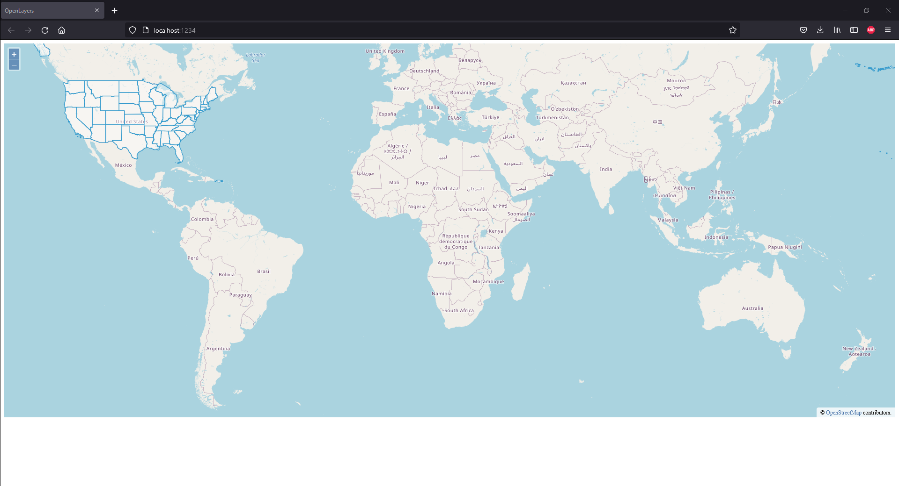
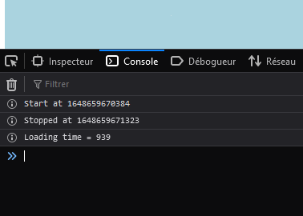

# Performance test
This project contains implementations of OpenLayers, Maplibre, Deck.gl and Leaflet on data of various sizes 
and we observe the execution times of each tool. <br/> <br/>
This README is still in construction
# Requirements
- npm (version 6.14.13 used in the performance test)
# Build & Tutorial
In order to reproduce this performance test you need to :
1. ```git clone https://github.com/SoufianBk/perftest.git```
2. Execute in the working directory : ```npm install```
3. Run the build script and then the execution script : ```npm run <script-name>``` With ``<script-name>`` described in ``package.json`` <br/>
For example if we want to execute the Openlayers implementation run ``npm run ol-build`` followed by ``npm run ol``
4. Open a browser with ```http://localhost:1234```
5. Finally to get the result, check the console of the browser (In Firefox press on ``F12``)
# Script names
Here is a list of all the scripts used (can be found in ```package.json```):
1. ``leaflet`` and ``leaflet-build`` for the Leaflet implementation
1. ``ol`` and ``ol-build`` for the OpenLayers implementation
1. ``ml`` and ``ml-build`` for the MapLibre implementation

# Datasets used
Here are the links of the datasets used :
1. An url containing data concerning all the counties in the USA (200 Mb) :
   https://raw.githubusercontent.com/jgoodall/us-maps/master/geojson/county.geo.json 
2. An url containing data concerning all the states in the USA (20 Mb) :
   https://raw.githubusercontent.com/jgoodall/us-maps/master/geojson/state.geo.json 
3. An url containing data concerning all the populated places in the world (2 Mb) :
   https://d2ad6b4ur7yvpq.cloudfront.net/naturalearth-3.3.0/ne_50m_populated_places.geojson
   
In order to change the data to display, change the ``var file = ...`` which is located at the start of each javascript file for each implementation
# Example
Running ```npm run ol``` displays the following : <br/> <br/>
 <br/> <br/>
Then the console displays (with ``F12``): <br/> <br/>

# Troubleshooting
When running a script after another, sometimes, the browser does not reload and does not display the wanted execution.
Here are some solutions : 
1. Do not forget to run the ``build`` script before running the execution
2. Remove ```.parcel-cache``` and ``dist`` folders (generated by ``npm run``)
3. Clear the browser cache. On firefox just press ```Ctrl + Shift + R```, it will reload the webpage and clears the cache